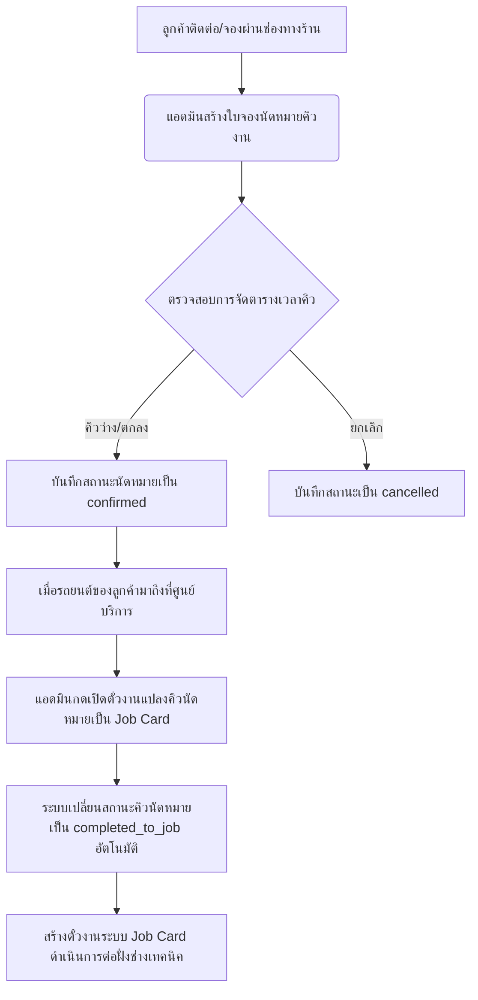
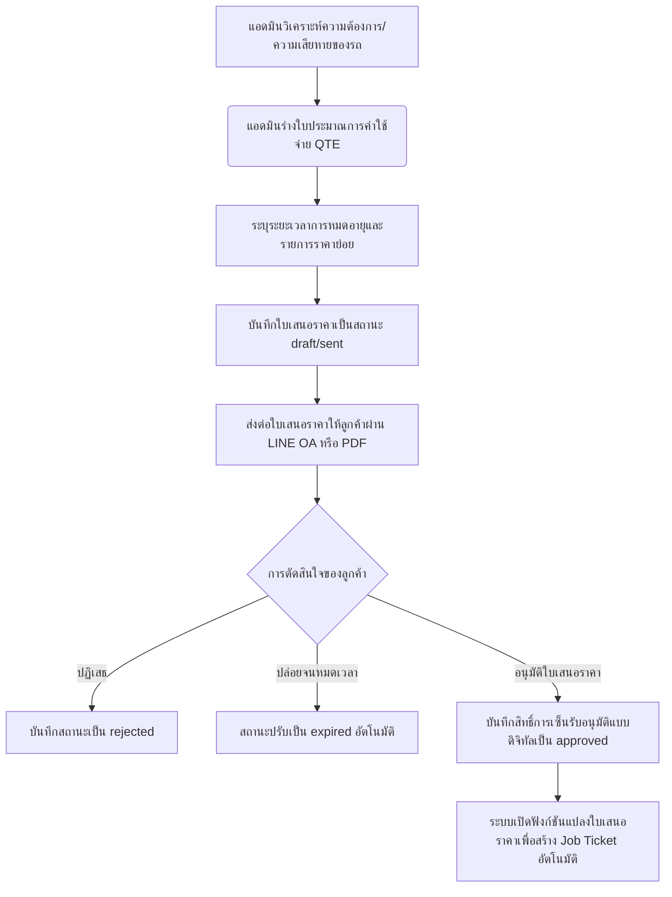

# แผนการพัฒนาโมดูลนัดหมายและใบเสนอราคา (Appointments & Quotations Implementation Plan)

แผนงานนี้จัดทำขึ้นสำหรับสถาปัตยกรรมระบบ **Den Modify Management System** โดยมุ่งเน้นการพัฒนาโมดูล **Appointments (ระบบนัดหมาย)** และ **Quotations (ระบบใบเสนอราคา)** ถัดจากระบบฐานข้อมูลและโครงสร้างพื้นฐานเดิม (Phase 1 Approved) ทั้งนี้การออกแบบจะเป็นไปตามข้อกำหนด Database Schema, UI Specification V3 และ API Specification V3 ทั้งหมดโดยไม่มีการปรับเปลี่ยนโครงสร้างหลักของระบบ

---

## 1. ตารางฐานข้อมูลที่เกี่ยวข้อง (Database Tables Used)

ในการทำงานร่วมกันของทั้งสองโมดูล จะมีการใช้งานตารางในระดับฐานข้อมูล PostgreSQL (ผ่าน Supabase) ดังต่อไปนี้:

### 1.1 ตารางของโมดูลนัดหมาย (Appointments Tables)
* **`public.appointments`**: จัดเก็บข้อมูลนัดหมายของลูกค้าเพื่อนำรถเข้ามาติดตั้ง/รับบริการ
  * `id` (UUID, Primary Key, Default `gen_random_uuid()`)
  * `branch_id` (UUID, REFERENCES `public.branches(id)`)
  * `customer_id` (UUID, REFERENCES `public.customers(id)`)
  * `car_id` (UUID, NULLABLE, REFERENCES `public.cars(id)`)
  * `appointment_date` (TIMESTAMPTZ, NOT NULL)
  * `service_type` (VARCHAR(50), CHECK: `wrap`, `ceramic`, `exhaust`, `general_checkup`)
  * `notes` (TEXT, NULLABLE)
  * `status` (VARCHAR(50), DEFAULT `pending`, CHECK: `pending`, `confirmed`, `cancelled`, `completed_to_job`)
  * `created_at` / `updated_at` / `deleted_at`

### 1.2 ตารางของโมดูลใบเสนอราคา (Quotations Tables)
* **`public.quotes`**: หัวข้อใบเสนอราคา/ประมาณการค่าใช้จ่ายหลัก
  * `id` (UUID, Primary Key, Default `gen_random_uuid()`)
  * `job_id` (UUID, NULLABLE, REFERENCES `public.jobs(id)`) - ผูกกับใบงานเมื่อลูกค้าอนุมัติเสนอราคาและสร้างเป็นงานจริง
  * `branch_id` (UUID, REFERENCES `public.branches(id)`)
  * `car_id` (UUID, REFERENCES `public.cars(id)`)
  * `customer_id` (UUID, REFERENCES `public.customers(id)`)
  * `status` (VARCHAR(50), DEFAULT `draft`, CHECK: `draft`, `sent`, `approved`, `expired`, `rejected`)
  * `valid_until` (TIMESTAMPTZ, NOT NULL)
  * `total_amount` (NUMERIC(12, 2), DEFAULT `0.00`)
  * `created_at` / `updated_at` / `deleted_at`
* **`public.quote_items`**: รายการบริการหรือชิ้นส่วนวัสดุภายใต้ใบเสนอราคา
  * `id` (UUID, Primary Key, Default `gen_random_uuid()`)
  * `quote_id` (UUID, REFERENCES `public.quotes(id) ON DELETE CASCADE`)
  * `description` (TEXT, NOT NULL)
  * `quantity` (INTEGER, CHECK: `> 0`)
  * `unit_price` (NUMERIC(12, 2))
  * `total_price` (NUMERIC(12, 2))
  * `item_type` (VARCHAR(50), CHECK: `service`, `part`)

---

## 2. โครงสร้างเส้นทางเชื่อมต่อข้อมูล (API Endpoints)

อ้างอิงตาม **API Specification V3** โครงสร้าง Route Handlers ที่จะถูกสร้างขึ้นใน `src/app/api/v1` ประกอบด้วย:

### 2.1 โมดูลนัดหมาย (Appointments API)
* **`GET /api/v1/appointments`**
  * **สิทธิ์การเข้าถึง:** Owner, Admin, Technician
  * **พารามิเตอร์ (Query):** `page`, `limit`, `search`, `filter_branch_id`, `filter_status`
  * **การทำ Data Isolation:** ตรวจสอบสิทธิ์และกรองสาขา หากไม่ใช่ Owner ระบบจะจำกัดผลลัพธ์เฉพาะ `branch_id` ของผู้ดึงข้อมูลเท่านั้น
* **`POST /api/v1/appointments`**
  * **สิทธิ์การเข้าถึง:** Owner, Admin
  * **การตรวจสอบข้อมูล (Zod Validation):**
    * `branch_id` (UUID, Option สำหรับ Owner)
    * `customer_id` (UUID, Required)
    * `car_id` (UUID, Option)
    * `appointment_date` (ISO String, ต้องเป็นเวลาในอนาคตเท่านั้น)
    * `service_type` (Enum: `wrap`, `ceramic`, `exhaust`, `general_checkup`)
    * `notes` (String, Max 2000 ตัวอักษร, Optional)

### 2.2 โมดูลใบเสนอราคา (Quotations API)
* **`GET /api/v1/quotes`**
  * **สิทธิ์การเข้าถึง:** Owner, Admin, Technician (พนักงานเทคนิคอ่านได้อย่างเดียวเฉพาะรถที่ตนได้รับมอบหมาย)
  * **พารามิเตอร์ (Query):** `page`, `limit`, `search`, `filter_branch_id`, `filter_status`
* **`POST /api/v1/quotes`**
  * **สิทธิ์การเข้าถึง:** Owner, Admin
  * **การตรวจสอบข้อมูล (Zod Validation):**
    * `branch_id` (UUID, Option)
    * `customer_id` (UUID, Required)
    * `car_id` (UUID, Required)
    * `valid_until` (ISO String, ต้องเป็นเวลาในอนาคต)
    * `items` (Array of Quote Items):
      * `description` (String, Required)
      * `quantity` (Integer >= 1)
      * `unit_price` (Number >= 0)
      * `item_type` (Enum: `service`, `part`)

---

## 3. หน้าจอการใช้งาน (UI Screens)

พัฒนาบนพื้นฐาน **Den Modify Brand Tokens** (Stealth-matte black `#0B0B0B`, Deep Charcoal `#111111` และ Den Modify Red Accent `#C40000`) ตามผังของ **UI Specification V3**:

### 3.1 สำหรับโมดูลระบบนัดหมาย
* **หน้าจอปฏิทินและตารางงานนัดหมาย (Admin Dashboard Integration - UI Spec 2.2):**
  * เพิ่มวิดเจ็ต **Booking Calendar** แสดงตารางนัดหมายแยกตามรายเดือนและสัปดาห์
  * แสดงแท็ก `PENDING APPOINTMENTS` พร้อมปุ่มกดด่วนเพื่อดูรายละเอียดใบนัด
  * กล่องข้อความแสดงสถานะนัดหมาย (`pending`, `confirmed`, `cancelled`, `completed_to_job`)
  * ปุ่ม **[+] New Appointment** เพื่อเรียกฟอร์มป็อปอัปในการกรอกจองเวลา

### 3.2 สำหรับโมดูลใบเสนอราคา
* **หน้ารายการใบเสนอราคาหลัก (Quotation List Screen - UI Spec 2.22):**
  * ตารางจัดเก็บข้อมูลใบเสนอราคาและประมาณการค่าใช้จ่าย พร้อมแถบค้นหาอัจฉริยะ (ค้นหาชื่อลูกค้า, ทะเบียนรถ หรือเลขที่ใบเสนอราคา)
  * สัญญาณเตือนกรณีหมดอายุ (`Expired` แจ้งเป็นไฟสีส้มเหลือง)
  * ปุ่มสร้างใบเสนอราคาใหม่ **[+] Create New Estimate**
* **หน้ารายละเอียดใบเสนอราคา (Quotation Detail Screen - UI Spec 2.23):**
  * การนำเสนอรูปเล่มใบประมาณราคาที่คมชัด โทนดำตัดขอบแดง เหมาะสำหรับการแสดงผลและพิมพ์ออกกระดาษ/ส่ง PDF ให้ลูกค้า
  * ส่วนแสดงรายการราคาแยกบริการและรายการชิ้นส่วนอย่างละเอียด
  * ปุ่มแปลงใบเสนอราคาเป็นตั๋วงาน **[>>> Approve & Convert to Job]** สำหรับแอดมินหลังได้รับอนุมัติจากลูกค้า

---

## 4. กระบวนการทำงานของผู้ใช้ (User Workflows)

### 4.1 กระบวนการนัดหมายและการเปิดตั๋วงาน (Appointment to Job Workflow)

### 4.2 กระบวนการสร้างและอนุมัติใบเสนอราคา (Quotation Approval Workflow)

---

## 5. กฎการควบคุมสิทธิ์ตามบทบาท (RBAC Rules)

| แฟ้มข้อมูล / ตารางข้อมูล | สิทธิ์ของบทบาท Owner | สิทธิ์ของบทบาท Admin | สิทธิ์ของบทบาท Technician |
| :--- | :--- | :--- | :--- |
| **ตาราง Appointments (การนัดหมาย)** | สามารถสร้าง, แก้ไข, ลบ และเรียกดูได้ทุกสาขาทั่วโลก | สามารถสร้าง, แก้ไข และเรียกดูได้เฉพาะสาขาตนเองเท่านั้น (ลบไม่ได้) | สามารถเรียกดูรายการคิวที่สาขาได้เท่านั้น เพื่อเตรียมตัวรับงาน (ห้ามแก้ไข/สร้าง) |
| **ตาราง Quotes (ใบเสนอราคา)** | สามารถสร้าง, แก้ไข, ลบ และออกใบเสนอราคาได้ทุกสาขา | สามารถสร้าง, แก้ไข และเข้าถึงข้อมูลใบเสนอราคาของสาขาตนเอง | สามารถอ่านรายละเอียดได้เท่านั้นเมื่อถูกผูกเข้ากับงานที่ตนเองเป็นผู้รับผิดชอบ |
| **ตาราง Quote Items (รายการราคาย่อย)** | จัดการได้สมบูรณ์ (สร้าง/ลบ/แก้ไข) | จัดการได้เฉพาะสาขาตนเอง | ไม่มีสิทธิ์เข้าถึงหรือแก้ไขข้อมูลราคาย่อย |

---

## 6. ความเสี่ยงหลักและมาตรการป้องกันภัย (Key Risks & Mitigations)

1. **ปัญหาข้อมูลความปลอดภัยรั่วไหลระหว่างสาขา (Cross-branch Data Leakage):**
   * *ความเสี่ยง:* การสืบค้นตาราง `appointments` หรือ `quotes` อาจเจอปัญหากรณี PostgREST (Supabase) กรองข้อมูลไม่หมด หากใช้ outer join ใน API ดึงข้อมูล
   * *แนวทางป้องกัน:* ในฝั่ง Route Handlers ให้บังคับการกรองระดับผู้ใช้งาน (`profiles.branch_id`) ด้วยคำสั่งเจาะจงหรือการใช้จอยแบบ `!inner` เช่น `.select("..., customers!inner(branch_id)")` เสมอ เพื่อรับประกันการ Isolation ของข้อมูลรายสาขาอย่างสมบูรณ์แบบ
2. **เงื่อนไขเวลาในการอนุมัติใบประมาณราคาคลาดเคลื่อน (Validity Race Conditions):**
   * *ความเสี่ยง:* ลูกค้ายืนยันอนุมัติใบเสนอราคาที่หมดอายุไปแล้ว หรือระบบยอมรับให้สร้าง Job Ticket จากใบเสนอราคาที่เป็น `expired`
   * *แนวทางป้องกัน:* ตั้งระบบตรวจเช็คเวลาที่ API ระดับหลังบ้าน โดยหาก `valid_until < now()` ระบบจะบล็อกการแก้ไขสเตตัสและการแปลงไปเป็น Job ทันที
3. **ความไม่สอดคล้องของรหัส UUID (UUID Invalidation Error):**
   * *ความเสี่ยง:* การยิง API หรือเชื่อมต่อหน้าบ้านโดยส่งรหัสที่ไม่ได้มาตรฐาน ส่งผลให้เกิด Internal Server Error
   * *แนวทางป้องกัน:* กำหนด Zod Schema ในการเช็คพารามิเตอร์ตัวแปร ID ทุกตัวด้วย `.uuid()` เพื่อดักจับข้อมูลที่ผิดพลาดตั้งแต่ด่านแรกสุดของ Route Handler

---

## 7. ลำดับแผนการสร้างชิ้นงานระบบ (Development Order)

เพื่อประสิทธิภาพสูงสุด จะใช้วิธีการทำเป็นระบบทีละชั้น (Layer-by-Layer) ดังนี้:

### [ขั้นตอนที่ 1] ซ่อมแซมระบบตั้งต้น (Phase 1 Fixes)
* ดำเนินการแก้ไข TypeScript build blockers และ Lint errors ทั้ง 3 จุดบนระบบก่อนเพื่อให้โปรเจกต์ Build ผ่านได้ปกติ

### [ขั้นตอนที่ 2] พัฒนา API หลังบ้านโมดูล Appointments
* เขียนสกีมา Zod และ Next.js Route Handlers สำหรับ `GET /api/v1/appointments` และ `POST /api/v1/appointments` พร้อมการจำกัดสิทธิ์ตาม RBAC

### [ขั้นตอนที่ 3] พัฒนา API หลังบ้านโมดูล Quotations
* เขียน Next.js Route Handlers สำหรับจัดการ `GET /api/v1/quotes`, `POST /api/v1/quotes` และระบบควบคุมการแปลงใบเสนอราคาไปเป็น Job Ticket

### [ขั้นตอนที่ 4] ออกแบบอินเตอร์เฟสและกล่องโต้ตอบการนัดหมาย (Appointments UI)
* พัฒนาหน้าแสดงปฏิทินนัดหมายแบบตอบสนองบน Admin Dashboard เชื่อมโยง API จริงและระบบการสร้างนัดหมายด้วย Modal ฟอร์ม

### [ขั้นตอนที่ 5] พัฒนาหน้าจอและรูปเล่มประมาณราคา (Quotations UI)
* พัฒนาหน้าจอ `Quotation List Screen` สำหรับจัดการและติดตามสถานะใบเสนอราคาทั้งหมด
* พัฒนาหน้าจอ `Quotation Detail Screen` รูปเล่มใบประมาณราคา โทนดำตัดแดง พร้อมปุ่มพิมพ์และปุ่มกดเพื่อสร้างงานจริง

### [ขั้นตอนที่ 6] ตรวจสอบความถูกต้องและทดสอบความแข็งแกร่ง (Verification)
* รันคำสั่งคอมไพล์เพื่อทดสอบความเสถียรผ่าน `npx tsc --noEmit` และตรวจทานมาตรฐานสากลด้วย `npm run lint` จนกว่าระบบจะสมบูรณ์ 100%
