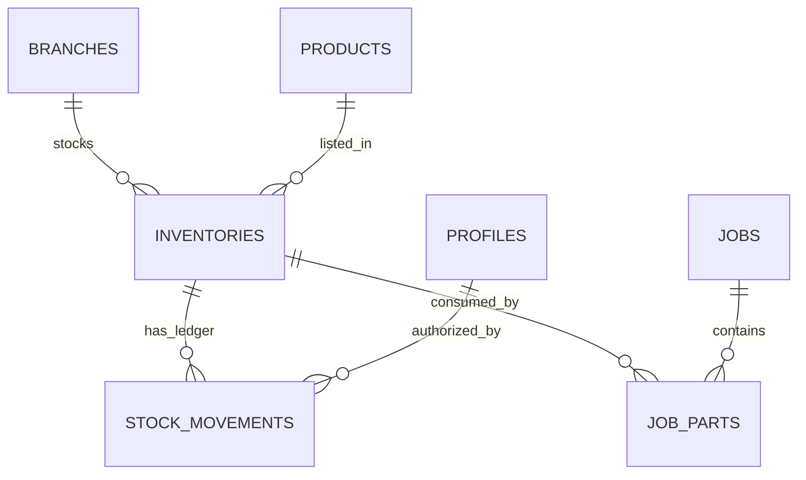
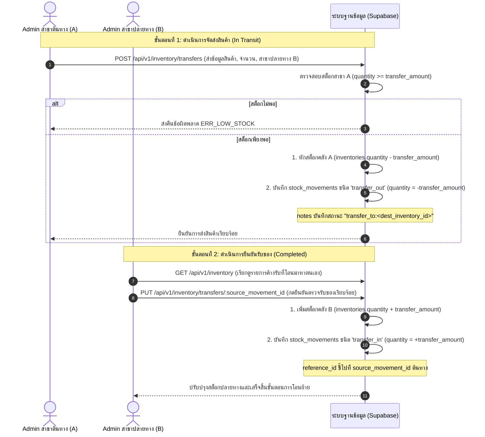
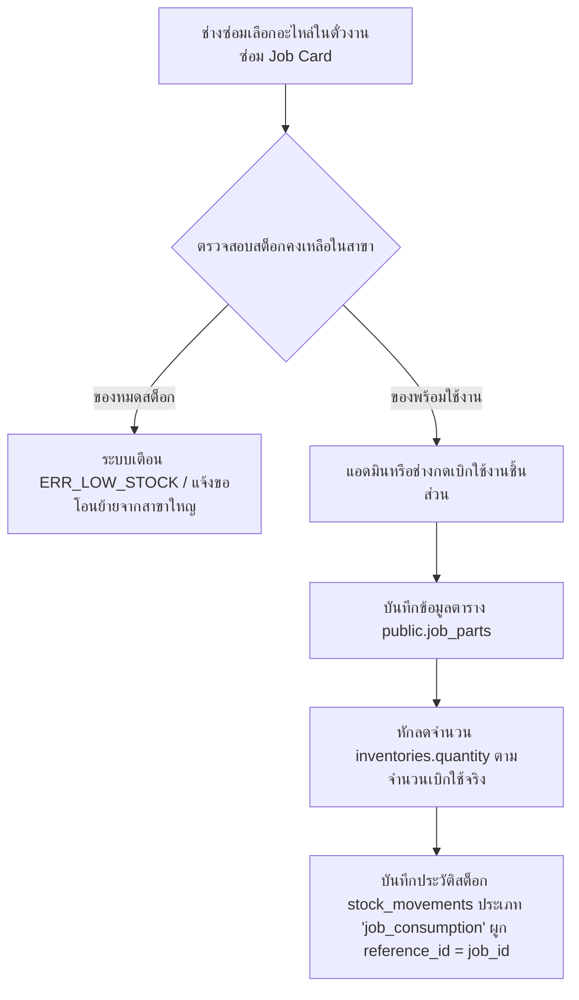
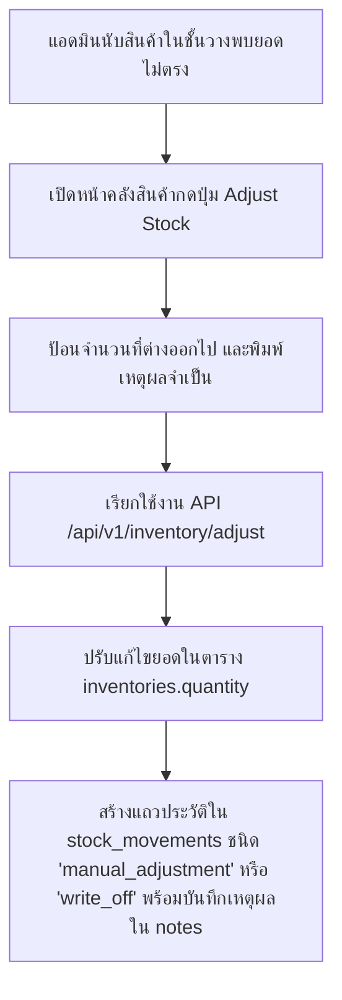

# PHASE 4 PLAN - Inventory Management Module

แผนการพัฒนาและออกแบบสถาปัตยกรรมโมดูล **Inventory Management (ระบบบริหารจัดการสินค้าคงคลัง)** สำหรับระบบ **Den Modify Management System** โดยอ้างอิงตาม Database Schema, UI Specification V3 และ API Specification V3 โดยรักษาสิทธิ์ความปลอดภัยรายสาขา (Branch Isolation) การควบคุมความปลอดภัยตามบทบาท (RBAC) และการตรวจสอบประวัติแบบละเอียด (Immutable Audit Trail)

---

## 1. โครงสร้างฐานข้อมูลและความสัมพันธ์ (Database Tables & Relationships)

โมดูลคลังสินค้าใช้ตารางฐานข้อมูลหลัก 3 ตาราง และตารางสัมพันธ์ 2 ตารางจากระบบเดิม:



### 1.1 รายละเอียดตารางคลังสินค้า
1. **`public.products` (ตารางแค็ตตาล็อกสินค้ากลาง):**
   * เก็บข้อมูลรายละเอียดสินค้า อะไหล่ และบริการหลักของทุกสาขา
   * คอลัมน์หลัก: `id` (UUID PK), `sku` (VARCHAR, UNIQUE), `barcode` (VARCHAR, UNIQUE, NULLABLE), `name`, `description`, `category` (Enum CHECK: `wraps`, `exhausts`, `coatings`, `bodykits`, `accessories`, `labor`), `unit_price` (ราคาทุน), `retail_price` (ราคาขายหน้าร้าน)
2. **`public.inventories` (ตารางระดับสต็อกรายสาขา):**
   * เชื่อมโยงสินค้ากับสาขา เพื่อระบุจำนวนคงเหลือและระดับที่ต้องสั่งซื้อเพิ่ม
   * คอลัมน์หลัก: `id` (UUID PK), `branch_id` (UUID FK), `product_id` (UUID FK), `quantity` (INTEGER, CHECK `>= 0`), `reorder_level` (INTEGER, DEFAULT 5)
   * *Constraint*: UNIQUE `(branch_id, product_id)` ป้องกันข้อมูลซ้ำซ้อน
3. **`public.stock_movements` (ตารางบันทึกประวัติการเดินคลัง - Immutable Ledger):**
   * ตารางประวัติบันทึกการเข้า-ออกของสินค้า ห้ามแก้ไขหรือลบ (Insert Only)
   * คอลัมน์หลัก: `id` (UUID PK), `inventory_id` (UUID FK), `quantity` (INTEGER), `type` (Enum CHECK: `stock_in`, `job_consumption`, `transfer_in`, `transfer_out`, `manual_adjustment`, `write_off`), `reference_id` (UUID, NULLABLE - ใช้โยงเอกสารอ้างอิง เช่น Job ID หรือโอนย้าย), `created_by` (UUID FK), `notes` (TEXT)

---

## 2. กระบวนการทำงาน (Workflows & Diagrams)

### 2.1 กระบวนการโอนย้ายสินค้าข้ามสาขา (Branch Transfer 2-Step Ledger Workflow)
เนื่องจากตารางฐานข้อมูลไม่มีตาราง `transfers` โดยตรง เราจะออกแบบระบบการโอนย้ายแบบปลอดภัยสูงสุดผ่านทางตารางประวัติ `stock_movements` เพื่อหลีกเลี่ยงการแก้ไขสกีมาและรับรองความโปร่งใส:



### 2.2 กระบวนการตัดอะไหล่สำหรับใบงาน (Job Parts Consumption Workflow)
เมื่อช่างเทคนิคทำการเบิกใช้วัสดุหรืออะไหล่สำหรับรถยนต์ในช่องซ่อม:



### 2.3 กระบวนการปรับปรุงสต็อกคงคลังด้วยมือ (Stock Adjustment Workflow)
ใช้สำหรับกรณีสินค้าเสียหาย หมดอายุ หรือตรวจพบของสูญหายตอนนับสต็อกสิ้นเดือน:



---

## 3. เส้นทางรับส่งข้อมูล (API Endpoints V3)

ทุกเส้นทางต้องระบุรหัสผ่านส่วนหัว `Authorization` JWT และใช้ Zod ในการคัดกรองข้อมูลขาเข้าอย่างเป็นทางการ

### 3.1 แค็ตตาล็อกสินค้า (Products API)
* **`GET /api/v1/products`**: ดึงข้อมูลแค็ตตาล็อกสินค้าส่วนกลาง
  * **สิทธิ์:** Owner, Admin, Technician
  * **ตัวกรอง:** `search` (ค้นหาตามชื่อ/SKU), `category` (กรองประเภท)
* **`POST /api/v1/products`**: เพิ่มรายการสินค้ากลางเข้าสู่ระบบ
  * **สิทธิ์:** Owner เท่านั้น (เพื่อคุมสัญลักษณ์ SKU กลางของแบรนด์)
  * **Zod Input:**
    ```typescript
    const createProductSchema = z.object({
      sku: z.string().min(3).max(100),
      barcode: z.string().max(100).optional(),
      name: z.string().min(2).max(200),
      description: z.string().optional(),
      category: z.enum(['wraps', 'exhausts', 'coatings', 'bodykits', 'accessories', 'labor']),
      unit_price: z.number().nonnegative(),
      retail_price: z.number().nonnegative(),
    });
    ```

### 3.2 ระบบบริหารจำนวนสต็อก (Inventory API)
* **`GET /api/v1/inventory`**: ดึงข้อมูลสต็อกแยกรายสาขา
  * **สิทธิ์:** Owner, Admin, Technician
  * **การทำขอบเขตสาขา (Data Isolation):**
    * หากบทบาทเป็น **Admin หรือ Technician** จะบังคับคัดกรองและเข้าถึงข้อมูลสต็อกเฉพาะ `branch_id` ของตนเองผ่าน API ทันที
    * หากบทบาทเป็น **Owner** จะอนุญาตให้ส่งพารามิเตอร์ `filter_branch_id` เพื่อสืบค้นข้อมูลในทุกสาขาทั่วประเทศได้
* **`PUT /api/v1/inventory/adjust`**: ปรับระดับสต็อกคลังด้วยตนเอง
  * **สิทธิ์:** Owner, Admin
  * **Zod Input:**
    ```typescript
    const adjustStockSchema = z.object({
      inventory_id: z.string().uuid(),
      quantity_change: z.number().int().refine((val) => val !== 0, "Change cannot be zero"),
      adjustment_type: z.enum(['stock_in', 'manual_adjustment', 'write_off']),
      notes: z.string().min(5),
    });
    ```

### 3.3 ระบบโอนย้ายสต็อกข้ามสาขา (Transfers API)
* **`POST /api/v1/inventory/transfers`**: ทำเรื่องโอนย้ายสินค้าข้ามสาขา
  * **สิทธิ์:** Owner, Admin
  * **Zod Input:**
    ```typescript
    const initiateTransferSchema = z.object({
      source_inventory_id: z.string().uuid(),
      destination_branch_id: z.string().uuid(),
      quantity: z.number().int().positive(),
    });
    ```
* **`PUT /api/v1/inventory/transfers/:source_movement_id`**: ยืนยันจดรับยอดสินค้าจากสาขาอื่น
  * **สิทธิ์:** Owner, Admin (ผู้รับต้องสังกัดสาขาปลายทางตามเงื่อนไขความปลอดภัย)

---

## 4. ส่วนติดต่อผู้ใช้งาน (UI Screens Blueprint)

ออกแบบตามโทนสีพรีเมียมดำตัดขอบแดงเรซซิ่ง กราฟิก Outfit และตัวอักษร Inter:

### 4.1 หน้ารายการสต็อกสินค้าคงคลังหลัก (Inventory Dashboard - UI Spec 2.7)
* **การแสดงผลหลัก:**
  * การ์ดสรุปจำนวนรายการสินค้า (Total SKUs), จำนวนเตือนของใกล้หมด (Low Stock Items), และรายการแจ้งเตือนค้างโอนข้ามสาขา
  * ตารางแสดงรายการพร้อมรหัส SKU, บาร์โค้ด, ชื่อ, ประเภท, สถานะ และสต็อกปัจจุบัน
  * **Low Stock Notification Alert:** แสดงผลไฟสีส้มเหลืองกะพริบดักสายตาหากสต็อก `quantity <= reorder_level` เพื่อแจ้งเตือนพนักงาน
* **ชุดควบคุมปฏิสัมพันธ์ (Action Buttons):**
  * ปุ่ม **Adjust Stock** เรียกฟอร์มแก้ไขยอดเพื่อป้อนจำนวนผลต่างและพิมพ์เหตุผล (สำหรับ Admin)
  * ปุ่ม **Transfer Stock** เรียกฟอร์มเลือกสินค้าคลังต้นทาง ระบุปลายทาง และป้อนจำนวน
  * ปุ่มยืนยันรับโอนย้ายคลังสินค้าเมื่อพบประจุค้างโอนในระบบ

### 4.2 หน้ารายละเอียดสินค้าคงคลังรายชิ้น (Product Detail - UI Spec 2.8)
* **การแสดงผลหลัก:**
  * รายละเอียดข้อมูลจำเพาะ บาร์โค้ด ราคาต้นทุน อัตรากำไร (Gross Margin %)
  * **Multi-branch Stock Levels Comparison:** กราฟเปรียบเทียบระดับสต็อกของสินค้าชิ้นนี้ในแต่ละสาขา เพื่ออำนวยความสะดวกในการตัดสินใจโอนสต็อกระหว่างสาขา
  * **Immutable Stock Movement Ledger Table:** ประวัติบันทึกการเบิกใช้ การปรับคลัง และการนำเข้าสินค้าคงคลังชิ้นนี้ย้อนหลัง (วันเวลา, ประเภท, จำนวนที่เปลี่ยน, ผู้ทำรายการ, หมายเหตุ)

---

## 5. กฎความปลอดภัย (RBAC & Isolation Rules)

### 5.1 ตารางตรวจสอบสิทธิ์ระดับผู้ใช้ (RBAC Controls Matrix)
| ฟังก์ชันระบบคลังสินค้า | บทบาท Owner | บทบาท Admin | บทบาท Technician |
| :--- | :--- | :--- | :--- |
| **เพิ่มประเภทสินค้าลง Catalog** | **อนุมัติ (Write/Delete)** | อ่านอย่างเดียว (Read Only) | อ่านอย่างเดียว (Read Only) |
| **สืบค้นจำนวนคลังรายสาขา** | ดูคลังได้ทุกสาขา | ดูเฉพาะคลังในสาขาของตนเอง | ดูเฉพาะคลังในสาขาของตนเอง |
| **ปรับสต็อกสินค้าคงคลังด้วยมือ** | **อนุมัติ (Write)** | **อนุมัติเฉพาะสาขาตนเอง** | ถูกบล็อกสิทธิ์การเข้าถึง |
| **โอนสต็อกสินค้าข้ามสาขา** | **อนุมัติและสั่งการได้ทุกที่** | **อนุมัติเฉพาะยอดโอนของตนเอง** | ถูกบล็อกสิทธิ์การเข้าถึง |
| **เรียกดูบันทึก Stock Ledger** | ดึงประวัติได้ทุกสาขาทั่วประเทศ | ดึงประวัติเฉพาะสาขาของตนเอง | ถูกบล็อกสิทธิ์การเข้าถึง |

### 5.2 กฎการแยกขอบเขตข้อมูลรายสาขา (Branch Isolation Strategy)
* **ระดับฐานข้อมูล (RLS):** ตาราง `inventories`, `stock_movements`, และ `job_parts` มีการใช้ Row-Level Security (RLS) โดยใช้เงื่อนไขตรวจสอบผ่านฟังก์ชันผู้ใช้ `public.is_branch_admin(branch_id)` หรือ `public.is_branch_staff(branch_id)` เพื่อป้องกันไม่ให้คิวรีข้ามสาขา
* **ระดับ Route Handler APIs:** ทุกการสืบค้นข้อมูลจะตรวจสอบจาก JWT Token และนำรหัส `profiles.branch_id` มายัดใส่ในพารามิเตอร์คิวรี Supabase แบบอัตโนมัติ เพื่อป้องกันช่องโหว่การปรับเปลี่ยนไอดีผ่านเบราว์เซอร์ของผู้ใช้

---

## 6. ลำดับและขั้นตอนการพัฒนาคลังสินค้า (Development Order)

การพัฒนาโมดูลบริหารคลังสินค้า จะถูกแบ่งย่อยออกเป็นขั้นตอนดังต่อไปนี้:

### [ระยะที่ 1]: ระบบหลังบ้านและโครงข่ายข้อมูลสินค้า (Backend API Handlers)
1. **Products API:** พัฒนาแค็ตตาล็อกสินค้า `/api/v1/products` (GET, POST)
2. **Inventory Core API:** พัฒนาการดึงระดับสินค้าคงคลังรายสาขา `/api/v1/inventory`
3. **Adjustment API:** พัฒนาระบบปรับจำนวนคงคลังด้วยมือ `/api/v1/inventory/adjust` (PUT)
4. **Ledger & Transfer Engine:** พัฒนาระบบประวัติและการสร้างระบบโอนย้ายคลังสินค้าข้ามสาขา `/api/v1/inventory/transfers` (POST, PUT)

### [ระยะที่ 2]: ระบบส่วนติดต่อผู้ใช้งานหลัก (Frontend Dashboard & Control Layouts)
1. **Inventory Dashboard Screen:** สร้างหน้าการควบคุมระดับสต็อก แสดง Low stock แจ้งเตือนสีส้มเหลือง และมีแท็กคิวคำสั่งโอนย้ายปลายทางรอการยืนยัน
2. **Modals Management:** สร้างป็อปอัปสำหรับการกดขอโอนย้าย (Initiate Transfer), การขอปรับสต็อกหน้างาน (Manual Adjustment Form)
3. **Product Detail View:** สร้างหน้ารายละเอียดเชิงลึก แสดงราคา ต้นทุน อัตรากำไร และเปรียบเทียบสต็อกทุกสาขา รวมถึงตารางการเดินบัญชีสินค้าย้อนหลัง

### [ระยะที่ 3]: ตรวจสอบมาตรฐานและความทนทานของระบบ (Quality & Verification Suite)
* ทำการรันคำสั่งยืนยันมาตรฐานความถูกต้องเพื่อให้โปรเจกต์ Build ผ่านได้สมบูรณ์:
  * `npm run lint` - ตรวจสอบความสะอาดของโค้ด (Zero errors/warnings)
  * `npx tsc --noEmit` - ตรวจทานความถูกต้องของโครงสร้าง TypeScript
  * `npm test` - ทดสอบ mock unit tests ทั้งหมด
