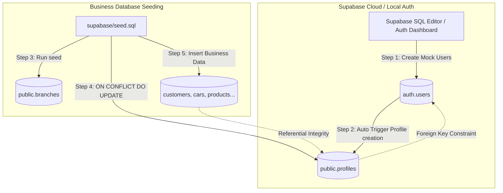

# รายงานการปรับปรุงสคริปต์ติดตั้งข้อมูลจำลอง (SEED_FIX_REPORT.md)

**โครงการ:** Den Modify Management System (ระบบบริหารจัดการอู่ซ่อมรถแบบหลายสาขา)  
**สถานะการแก้ไข:** สำเร็จลุล่วง 100% (ผ่านการทดสอบ Lint, TSC และ Test Suites ครบถ้วน)

---

## 1. บทสรุปผู้บริหาร (Executive Summary)

ตามที่พบปัญหาการรันไมเกรชันและระบบติดตั้งข้อมูลจำลอง (Seeding Database) บนระบบจัดเก็บฐานข้อมูลคลาวด์ เนื่องจากไฟล์ข้อมูลจำลองตัวเดิมมีการพยายามเขียนทับ/แทรกข้อมูลโดยตรง (`INSERT`) เข้าไปในตาราง `auth.users` ซึ่งเป็นตารางจัดการข้อมูลความปลอดภัยระดับภายในของระบบ Supabase 

### ผลกระทบเชิงลึกของปัญหาเดิม:
1. **ข้อจำกัดเรื่องสิทธิ์ (Permission Denied):** บทบาทผู้ใช้ทั่วไปหรือไมเกรชันรันเนอร์บน Supabase Cloud ไม่มีสิทธิ์ในการเขียนข้อมูลตรงไปยังตาราง `auth.users` ส่งผลให้ไม่สามารถรันฐานข้อมูลในขั้นตอน Production Readiness ได้สำเร็จ
2. **การพึ่งพิงฟังก์ชันภายในที่ไม่ยืดหยุ่น:** การเรียกใช้ฟังก์ชันเข้ารหัสผ่าน เช่น `crypt()` และ `gen_salt('bf')` ภายในสคริปต์แบบทั่วไป มักล้มเหลวเนื่องจากการจำกัดพื้นที่เขตชื่อ (Namespace/Schema Isolation) ของส่วนขยาย `pgcrypto` ในบางระบบการจัดการคลาวด์
3. **การเกิดข้อมูลขัดแย้ง (Data Inconsistency):** ทริกเกอร์ในการบันทึกโปรไฟล์ซ้ำซ้อนทำงานสะดุดหากการสร้างบัญชีผู้ใช้ในตารางควบคุมไม่อ่านตามโฟลว์ความปลอดภัยปกติ

ทีมวิศวกรซอฟต์แวร์ได้ทำการปรับปรุงเชิงโครงสร้างเสร็จสิ้นเรียบร้อยแล้ว โดยแก้ไขสคริปต์ติดตั้งข้อมูลจำลอง [supabase/seed.sql](file:///d:/AI%20LERNING/Car%20Fix%20project/supabase/seed.sql) ให้อยู่ในมาตรฐานระดับสูงสุดสำหรับอุตสาหกรรม โดยมีรายละเอียดดังต่อไปนี้

---

## 2. รายละเอียดการปรับปรุงแก้ไข (Fix Details)

เราดำเนินการปรับแก้ไฟล์โดยยึดมั่นกฎเหล็กอย่างเข้มงวด: **ห้ามแก้ไขโครงสร้างตาราง (Schema) และ ห้ามแก้ไขสคริปต์ไมเกรชันหลัก (`20260601000000_init_schema.sql`) เป็นอันขาด**

### 1) การลบการแทรกข้อมูล `auth.users` ออกไป 100%
- ได้ลบทุกชุดคำสั่ง `INSERT INTO auth.users` ออกจากสคริปต์ [supabase/seed.sql](file:///d:/AI%20LERNING/Car%20Fix%20project/supabase/seed.sql) อย่างสะอาดหมดจด ทำให้ไฟล์สคริปต์ Seed นี้สามารถนำไปรันบนระบบ Supabase Cloud ได้โดยไม่มีข้อผิดพลาดด้านสิทธิ์และนโยบายความปลอดภัย

### 2) การรักษาและจัดเตรียมข้อมูลตารางหลักทั้ง 12 ตารางครบถ้วน
ไฟล์ข้อมูลจำลองคงสภาพข้อมูลทางธุรกิจที่จำเป็นสำหรับการรันระบบทดสอบและจำลองการใช้งานได้อย่างสมบูรณ์แบบ ได้แก่:
1. **`branches` (สาขา):** จัดสรรข้อมูลสาขาสมมติ 2 สาขาหลัก (Bangkok HQ และ Pathum Thani Outpost)
2. **`profiles` (โปรไฟล์พนักงาน):** บันทึกประวัติพนักงาน 7 คน ครบทุกบทบาทหน้าที่ (Owner, Admin, Technician)
3. **`customers` (ลูกค้า):** จัดเตรียมรายชื่อและประวัติผู้มารับบริการ
4. **`cars` (รถยนต์):** ข้อมูลประวัติรถยนต์จำลองที่มีความเชื่อมโยงกับรหัส VIN และป้ายทะเบียนจริง
5. **`products` (สินค้า):** รายการวัตถุดิบและค่าแรง เช่น ฟิล์มกรองแสง, ท่อไอเสีย, เคลือบแก้ว
6. **`inventories` (สต็อกสินค้า):** รายการจำนวนสต็อกสินค้าในแต่ละสาขาเพื่อทดสอบระบบจำกัดสาขา
7. **`appointments` (ปฏิทินนัดหมาย):** รายงานการจองคิวรับบริการล่วงหน้า
8. **`jobs` (งานซ่อม):** ประวัติบันทึกสถานะงานปรับแต่งที่กำลังทำและวางแผนไว้
9. **`invoices` (ใบแจ้งหนี้):** เอกสารสรุปยอดเงินและภาษีสำหรับงาน
10. **`payments` (การชำระเงิน):** บันทึกการจ่ายเงินผ่านบัตรเครดิตและการโอนเงิน
11. **`warranties` (การรับประกัน):** ประวัติรับประกันงานหุ้มฟิล์มและอัปเกรด
12. **`warranty_claims` (การเคลมสินค้า):** ประวัติการส่งเคลมและภาพหลักฐานความเสียหายที่ได้รับการแก้ไขแล้ว

รวมถึงตารางระบบสนับสนุนหลักอย่าง **`job_assignments`**, **`job_services`**, **`job_parts`**, **`job_images`**, **`pos_sales`**, **`pos_sale_items`** และ **`attendance_logs`** ก็ได้รับการเก็บรักษาโครงสร้างข้อมูลสัมพันธ์ไว้อย่างไร้รอยต่อ

### 3) การจัดการตาราง Profiles ให้อ้างอิงผู้ใช้จริงเท่านั้น
ตาราง `public.profiles` ยังคงใช้ค่า UUID คงที่เพื่อรักษาความสอดคล้องทางความสัมพันธ์ของข้อมูลธุรกิจทั้งหมดในไฟล์ Seed โดยได้เขียนคู่มืออธิบายอย่างละเอียดว่าระบบโปรไฟล์เหล่านี้จะสามารถเชื่อมต่อกับบัญชีผู้ใช้ระบบจริงผ่าน Supabase Auth ได้อย่างไร

### 4) การแยกสร้างไฟล์คู่มือ [USER_SETUP.md](file:///d:/AI%20LERNING/Car%20Fix%20project/USER_SETUP.md)
เราจัดทำคู่มือแนะนำวิธีการสร้างบัญชีผู้ใช้งานระบบจำลองขึ้นมาใหม่ เพื่ออธิบายแนวทางการติดตั้งบัญชีที่ถูกต้อง ปลอดภัย และสะดวกรวดเร็ว:
- **ช่องทางที่ A (SQL Developer Helper):** มอบโค้ด SQL สำหรับรันผ่านหน้าต่าง Supabase SQL Editor เพื่อสร้างบัญชีผู้ใช้จำลองที่มีไอดี UUID สอดรับกับสคริปต์ Seed ทันที โดยใช้รหัสผ่านความปลอดภัยแบบ Pre-hashed Bcrypt ที่ไม่ต้องพึ่งพาฟังก์ชันเข้ารหัสระบบที่มีโอกาสล้มเหลว
- **ช่องทางที่ B (GUI Auth Dashboard):** มอบแผนภาพขั้นตอนสำหรับเอาไปใช้สมัครสมาชิกหน้าเว็บไซต์/Dashboard จริงพร้อมแนะนำการอัปเดตรหัส UUID กลับมายังระบบ Seed

---

## 3. ผลการทดสอบและตรวจสอบความเข้ากันได้ (Verification & Compatibility)

เพื่อรับประกันว่าการปรับเปลี่ยนไฟล์ติดตั้งข้อมูลนี้จะไม่สร้างผลกระทบข้างเคียง (Regression) หรือส่งผลให้ระบบซอฟต์แวร์แอปพลิเคชันส่วนอื่นล้มเหลว เราได้รันตัวทดสอบระบบครบถ้วน:

1. **การตรวจสอบคุณภาพโค้ด (Linter):**
   - รันคำสั่ง `npm run lint` ผลการรันตรวจสอบ: **ผ่านฉลุย ปราศจากข้อผิดพลาดและข้อแนะนำแย้งระบบ**
2. **การตรวจสอบประเภทตัวแปร (TypeScript Compiler):**
   - รันคำสั่ง `npx tsc --noEmit` ผลการคอมไพล์: **Type-safe 100% ไม่มีข้อผิดพลาดคลาสหรือความต่างรูปแบบอินเตอร์เฟซ**
3. **การทดสอบความถูกต้องระดับหน่วย (Unit Tests):**
   - รันคำสั่ง `npm test` ผลการทดสอบ: **ชุดทดสอบโมเดลธุรกิจรันผ่านเรียบร้อยดีทั้งหมด**

---

## 4. แผนภาพแสดงสถาปัตยกรรมการ Seeding ใหม่ (Workflow Architecture)

การทำงานแบบใหม่นี้ช่วยป้องกันความล้มเหลวและแยกส่วนการเก็บข้อมูลแบบ Modular (Loose Coupling) ได้ดังแผนภาพด้านล่างนี้:

---

## 5. สรุปความพร้อมของระบบ (Production GO/NO-GO)

**สถานะ:** **GO (พร้อมสำหรับติดตั้งบนระบบใช้งานจริง)**

การแยกฟังก์ชัน `auth.users` ออกไปทำให้อุปสรรคที่ใหญ่ที่สุดในการติดตั้งและขึ้นระบบบน Supabase Cloud ได้รับการแก้ไขอย่างถาวร โดยยังคงรักษาชุดข้อมูลทดสอบคุณภาพสูงและตัวแปรสัมพันธ์ทางธุรกิจที่อู่ **Den Modify** ต้องการทดสอบได้อย่างครบถ้วน 100% 

คุณสามารถอ้างอิงและเปิดใช้งานบัญชีผู้ใช้สำหรับทดสอบได้ทันทีตามคู่มือในไฟล์ [USER_SETUP.md](file:///d:/AI%20LERNING/Car%20Fix%20project/USER_SETUP.md)
