# Entity Relationship Diagram (ERD) - Refactored Version

This document contains the refactored, production-grade Entity Relationship Diagram (ERD) for the **Den Modify Management System** database. The schema is optimized for a single-company, multi-branch architecture, with strict role-based access control, soft-deletes, multi-technician job assignments, POS integration, and detailed inventory tracking.

## Mermaid ERD

Below is the updated database structure. All tables are in the `public` schema.

```mermaid
erDiagram
    BRANCHES ||--o{ PROFILES : "has employees"
    BRANCHES ||--o{ CUSTOMERS : "registered at"
    BRANCHES ||--o{ INVENTORIES : "holds stock"
    BRANCHES ||--o{ JOBS : "executes"
    BRANCHES ||--o{ QUOTES : "issues"
    BRANCHES ||--o{ INVOICES : "bills"
    BRANCHES ||--o{ POS_SALES : "processes POS"
    BRANCHES ||--o{ ATTENDANCE_LOGS : "logs attendance at"
    BRANCHES ||--o{ APPOINTMENTS : "books at"

    PROFILES }|--|| auth_users : "extends auth.users"
    PROFILES ||--o{ JOBS : "creates"
    PROFILES ||--o{ JOB_ASSIGNMENTS : "assigned to"
    PROFILES ||--o{ JOB_SERVICES : "performs"
    PROFILES ||--o{ STOCK_MOVEMENTS : "authorizes"
    PROFILES ||--o{ POS_SALES : "rings up"
    PROFILES ||--o{ ATTENDANCE_LOGS : "registers hours"
    PROFILES ||--o{ WARRANTY_CLAIMS : "resolves claim"
    PROFILES ||--o{ JOB_IMAGES : "uploads"
    PROFILES ||--o{ AUDIT_LOGS : "performs actions"

    CUSTOMERS ||--o{ CARS : "owns"
    CUSTOMERS ||--o{ JOBS : "requests"
    CUSTOMERS ||--o{ QUOTES : "receives"
    CUSTOMERS ||--o{ INVOICES : "billed to"
    CUSTOMERS ||--o{ POS_SALES : "makes purchase"
    CUSTOMERS ||--o{ WARRANTIES : "holds warranty"
    CUSTOMERS ||--o{ APPOINTMENTS : "schedules"

    CARS ||--o{ JOBS : "modified in"
    CARS ||--o{ QUOTES : "quoted for"
    CARS ||--o{ WARRANTIES : "covered"
    CARS ||--o{ APPOINTMENTS : "scheduled for"

    PRODUCTS ||--o{ INVENTORIES : "stocked as"
    PRODUCTS ||--o{ POS_SALE_ITEMS : "sold as"
    PRODUCTS ||--o{ WARRANTIES : "warranted product"

    INVENTORIES ||--o{ STOCK_MOVEMENTS : "tracks changes of"
    INVENTORIES ||--o{ JOB_PARTS : "allocated from"

    JOBS ||--o{ JOB_SERVICES : "contains"
    JOBS ||--o{ JOB_PARTS : "uses"
    JOBS ||--o{ JOB_ASSIGNMENTS : "has team"
    JOBS ||--o{ JOB_IMAGES : "documented by"
    JOBS ||--o{ QUOTES : "based on"
    JOBS ||--o{ INVOICES : "produces"
    JOBS ||--o{ WARRANTIES : "results in"

    QUOTES ||--o{ QUOTE_ITEMS : "contains"

    INVOICES ||--o{ PAYMENTS : "collects"
    INVOICES ||--o{ POS_SALES : "reconciles with"

    POS_SALES ||--o{ POS_SALE_ITEMS : "contains"
    POS_SALES ||--o{ WARRANTIES : "grants warranty"

    WARRANTIES ||--o{ WARRANTY_CLAIMS : "protects"

    BRANCHES {
        uuid id PK
        varchar name
        varchar address
        varchar phone
        timestamptz created_at
        timestamptz updated_at
        timestamptz deleted_at
    }

    PROFILES {
        uuid id PK "refers auth.users"
        varchar email
        varchar full_name
        varchar role "owner | admin | technician"
        uuid branch_id FK "nullable for Owner"
        boolean is_active
        timestamptz created_at
        timestamptz updated_at
        timestamptz deleted_at
    }

    CUSTOMERS {
        uuid id PK
        uuid branch_id FK
        varchar full_name
        varchar phone
        varchar email
        varchar line_user_id
        timestamptz created_at
        timestamptz updated_at
        timestamptz deleted_at
    }

    CARS {
        uuid id PK
        uuid customer_id FK
        varchar license_plate
        varchar province
        varchar make
        varchar model
        integer year
        varchar color
        varchar vin
        timestamptz created_at
        timestamptz updated_at
        timestamptz deleted_at
    }

    PRODUCTS {
        uuid id PK
        varchar sku "unique"
        varchar barcode "unique, nullable"
        varchar name
        text description
        varchar category "wraps | exhausts | coating | etc"
        numeric unit_price
        numeric retail_price
        timestamptz created_at
        timestamptz updated_at
        timestamptz deleted_at
    }

    INVENTORIES {
        uuid id PK
        uuid branch_id FK
        uuid product_id FK
        integer quantity
        integer reorder_level
        timestamptz created_at
        timestamptz updated_at
        timestamptz deleted_at
    }

    STOCK_MOVEMENTS {
        uuid id PK
        uuid inventory_id FK
        integer quantity
        varchar type "stock_in | job_consumption | transfer_in | etc"
        uuid reference_id "nullable reference"
        uuid created_by FK "refers Profiles"
        text notes
        timestamptz created_at
    }

    JOBS {
        uuid id PK
        uuid branch_id FK
        uuid car_id FK
        uuid customer_id FK
        varchar status "draft | scheduled | in_progress | completed | etc"
        uuid created_by FK "refers Profiles"
        timestamptz scheduled_start
        timestamptz scheduled_end
        timestamptz actual_start
        timestamptz actual_end
        text notes
        numeric total_amount
        timestamptz created_at
        timestamptz updated_at
        timestamptz deleted_at
    }

    JOB_ASSIGNMENTS {
        uuid id PK
        uuid job_id FK
        uuid profile_id FK "refers Profiles"
        varchar assigned_role "lead_technician | assistant_technician"
        timestamptz assigned_at
    }

    JOB_SERVICES {
        uuid id PK
        uuid job_id FK
        varchar name
        text description
        numeric price
        varchar status "pending | in_progress | completed"
        uuid assigned_technician_id FK "refers Profiles"
        timestamptz created_at
        timestamptz updated_at
    }

    JOB_PARTS {
        uuid id PK
        uuid job_id FK
        uuid inventory_item_id FK "refers Inventories"
        integer quantity
        numeric unit_price
        numeric total_price
        timestamptz created_at
        timestamptz updated_at
    }

    JOB_IMAGES {
        uuid id PK
        uuid job_id FK
        text image_url
        varchar image_type "before | in_progress | after | qc_fail"
        text description
        uuid uploaded_by FK "refers Profiles"
        timestamptz created_at
    }

    QUOTES {
        uuid id PK
        uuid job_id FK "nullable"
        uuid branch_id FK
        uuid car_id FK
        uuid customer_id FK
        varchar status "draft | sent | approved | expired | rejected"
        timestamptz valid_until
        numeric total_amount
        timestamptz created_at
        timestamptz updated_at
        timestamptz deleted_at
    }

    QUOTE_ITEMS {
        uuid id PK
        uuid quote_id FK
        varchar description
        integer quantity
        numeric unit_price
        numeric total_price
        varchar item_type "service | part"
    }

    INVOICES {
        uuid id PK
        uuid branch_id FK
        uuid job_id FK "nullable"
        uuid customer_id FK
        varchar invoice_number "unique"
        numeric amount_due
        numeric tax_amount
        numeric discount_amount
        numeric total_amount
        varchar status "unpaid | partially_paid | paid | void"
        timestamptz due_date
        timestamptz created_at
        timestamptz updated_at
        timestamptz deleted_at
    }

    PAYMENTS {
        uuid id PK
        uuid invoice_id FK
        numeric amount
        varchar payment_method
        varchar transaction_reference
        timestamptz payment_date
        timestamptz created_at
    }

    POS_SALES {
        uuid id PK
        uuid branch_id FK
        uuid customer_id FK "nullable"
        uuid invoice_id FK "nullable"
        varchar sales_number "unique"
        numeric subtotal
        numeric tax_amount
        numeric discount_amount
        numeric total_amount
        varchar status "completed | refunded | cancelled"
        uuid created_by FK "refers Profiles"
        timestamptz created_at
        timestamptz updated_at
    }

    POS_SALE_ITEMS {
        uuid id PK
        uuid pos_sale_id FK
        uuid product_id FK "nullable"
        varchar description
        integer quantity
        numeric unit_price
        numeric total_price
    }

    ATTENDANCE_LOGS {
        uuid id PK
        uuid profile_id FK
        uuid branch_id FK
        timestamptz clock_in
        timestamptz clock_out "nullable"
        varchar status "on_time | late | absent"
        numeric latitude "nullable"
        numeric longitude "nullable"
        varchar selfie_url "nullable"
        text notes
        timestamptz created_at
    }

    APPOINTMENTS {
        uuid id PK
        uuid branch_id FK
        uuid customer_id FK
        uuid car_id FK "nullable"
        timestamptz appointment_date
        varchar service_type "wrap | ceramic | exhaust | etc"
        text notes
        varchar status "pending | confirmed | cancelled | completed_to_job"
        timestamptz created_at
        timestamptz updated_at
        timestamptz deleted_at
    }

    WARRANTIES {
        uuid id PK
        uuid customer_id FK
        uuid car_id FK
        uuid job_id FK "nullable"
        uuid pos_sale_id FK "nullable"
        uuid product_id FK "nullable"
        varchar warranty_code "unique"
        timestamptz start_date
        timestamptz end_date
        varchar status "active | expired | void"
        timestamptz created_at
        timestamptz updated_at
        timestamptz deleted_at
    }

    WARRANTY_CLAIMS {
        uuid id PK
        uuid warranty_id FK
        timestamptz claim_date
        text description
        varchar status "pending | approved | rejected | completed"
        varchar image_url "nullable"
        uuid resolved_by FK "refers Profiles"
        text resolution_notes
        timestamptz created_at
        timestamptz updated_at
    }

    AUDIT_LOGS {
        uuid id PK
        uuid profile_id FK "nullable"
        varchar action
        varchar table_name
        uuid record_id
        jsonb old_values
        jsonb new_values
        varchar ip_address
        timestamptz created_at
    }
```

